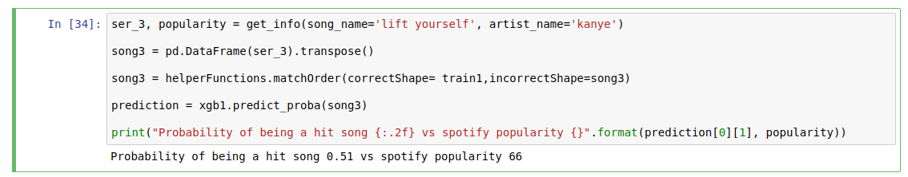

# Predicting Song Popularity

[Featured Blog Post](https://towardsdatascience.com/song-popularity-predictor-1ef69735e380) 

## Install Dependencies

`
pipenv install
`

## Make Predictions 
Use an XGBoost classifier to see whether or not a song will be a hit and compare it to Spotify API's popularity score

